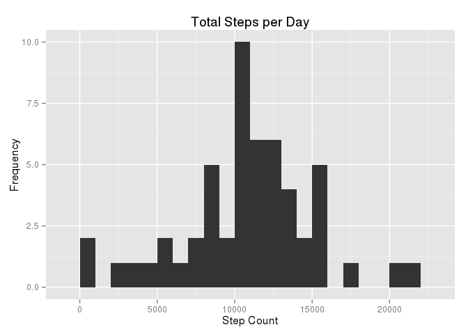
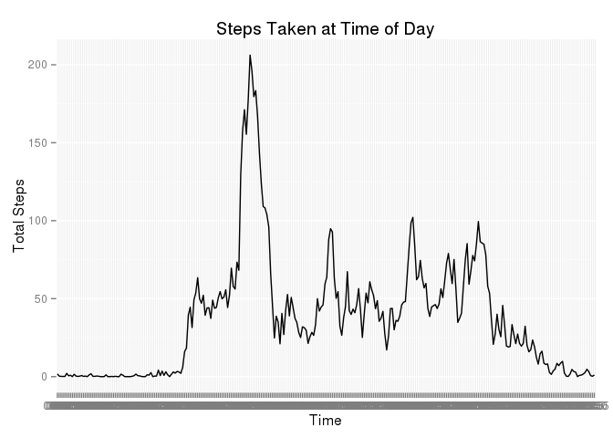
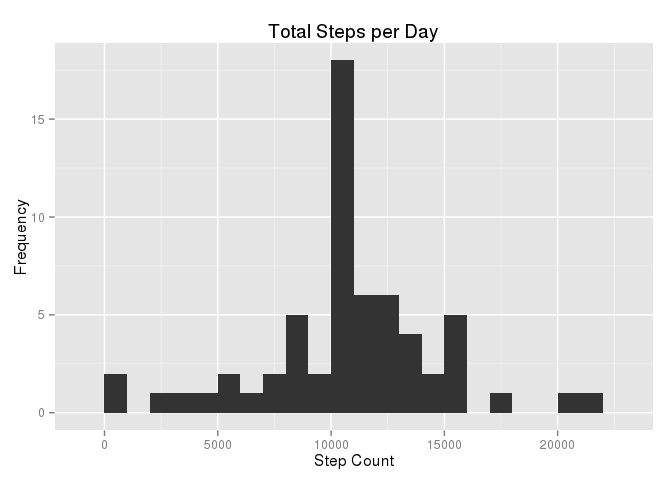
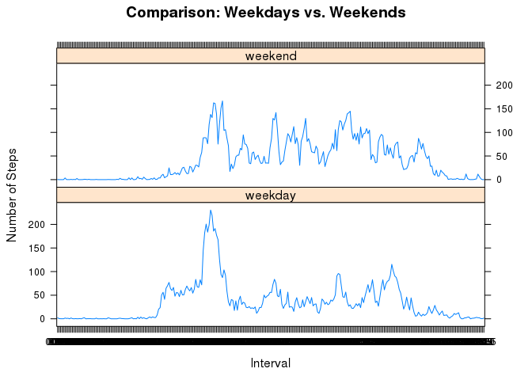

# Reproducible Research: Peer Assessment 1


## Loading and preprocessing the data


```r
echo = TRUE

require(knitr)
```

```
## Loading required package: knitr
```

```r
require(ggplot2)
```

```
## Loading required package: ggplot2
```

```r
require(dplyr)
```

```
## Loading required package: dplyr
## 
## Attaching package: 'dplyr'
## 
## The following object is masked from 'package:stats':
## 
##     filter
## 
## The following objects are masked from 'package:base':
## 
##     intersect, setdiff, setequal, union
```

```r
require(plyr)
```

```
## Loading required package: plyr
## -------------------------------------------------------------------------
## You have loaded plyr after dplyr - this is likely to cause problems.
## If you need functions from both plyr and dplyr, please load plyr first, then dplyr:
## library(plyr); library(dplyr)
## -------------------------------------------------------------------------
## 
## Attaching package: 'plyr'
## 
## The following objects are masked from 'package:dplyr':
## 
##     arrange, count, desc, failwith, id, mutate, rename, summarise,
##     summarize
```

```r
require(lattice)
```

```
## Loading required package: lattice
```

```r
data <- read.csv('activity.csv')
tmp <- mapply(function(x, y) paste0(rep(x, y), collapse = ""), 
              0, 4 - nchar(data$interval))
data$interval <- paste0(tmp, data$interval)
data$interval <- format(strptime(data$interval, format="%H%M"), format = "%H:%M")
```


## What is mean total number of steps taken per day?
This histogram illustrates the nummber of steps taken per day.


```r
daystepcount <- aggregate(steps ~ date, data = data, na.rm = TRUE, sum)
qplot(steps, data = daystepcount, 
      xlab = "Step Count", 
      ylab = "Frequency", 
      main = "Total Steps per Day", 
      binwidth = 1000)
```

 

Calculating the mean and median is straightforward:

Mean:

```r
mean(daystepcount$steps)
```

```
## [1] 10766.19
```

Median:

```r
median(daystepcount$steps)
```

```
## [1] 10765
```


## What is the average daily activity pattern?
In order to visualize the daily activity pattern, we draw a line graph.  This graph shows walking patterns over the course of the day, with a daily peak just before 9:00am and the final local peak before 7:00pm. Each hash on the Time axis (x-axis) represents a 5 minute interval.


```r
aggregated_data <- aggregate(steps ~ interval, data = data, na.rm = TRUE, mean)

qplot(interval, steps, 
    data = aggregated_data, 
    group = "interval", 
    geom= "line",
    type = "l",
    xlab = "Time",
    ylab = "Total Steps",
    main = "Steps Taken at Time of Day")
```

 

Next, find the 5-minute interval with the highest average step count:


```r
aggregated_data[which.max(aggregated_data$steps), 1]
```

```
## [1] "08:35"
```


## Imputing missing values
In order to properly impute the missing values, first count the total number of NAs in the data set:


```r
nrow(data[!complete.cases(data),])
```

```
## [1] 2304
```

In order to impute the missing values in this data set, we will use the value from the corresponding interval of the aggregated data.  This function will assign those values to the NA data: 


```r
imputed_data <- adply(data, 1, function(x) 
    if (is.na(x$steps)) {
      x$steps = round(aggregated_data[aggregated_data$interval == x$interval,2])
    x
} else {
    x
})
```

Complete the new data set and graph the new values, which will have higher tallies since the NAs were ignored in the previous graphs:


```r
ImputeByDay <- aggregate(steps ~ date, imputed_data, sum)
ImputeByDay <- cbind(ImputeByDay, label = rep("without.na", nrow(ImputeByDay)))

qplot(steps, data = ImputeByDay, 
      xlab = "Step Count", 
      ylab = "Frequency", 
      main = "Total Steps per Day", 
      binwidth = 1000)
```

 

Again, calculating the mean and median of the data set with imputed values is straightforward.

Mean(using imputed values):

```r
mean(ImputeByDay$steps)
```

```
## [1] 10765.64
```

Median(using imputed values):

```r
median(ImputeByDay$steps)
```

```
## [1] 10762
```

These values do not differ significantly from the estimates from the first part of the assignment since we substituted the mean for the NAs.  By imputing missing data, we are raising the frequency of step counts since we were simply ignoring the NA values previously.

## Are there differences in activity patterns between weekdays and weekends?
We would expect a difference between the number of steps taken in a given interval on a weekday vs. a weekend.  In order to verify this trend, we must first classify each day as a weekend or a weekday.


```r
days <- weekdays(as.POSIXlt(imputed_data$date))
weekend <- (days == "Saturday" | days == "Sunday")
dayfactor <- factor(weekend, labels = list("weekday", "weekend"))
imputed_data$daytype <- dayfactor
```

Now find the average step counts for a given weekday and weekend interval, preparing to graph:

```r
binnedData <- aggregate(imputed_data$steps, 
                        list(Type_of_Day = imputed_data$daytype,
                             Interval = imputed_data$interval),
                        mean)
```

And graph the results:


```r
xyplot(as.numeric(binnedData$x) ~ as.factor(binnedData$Interval) | 
                                  as.factor(binnedData$Type_of_Day), 
       layout = c(1, 2), 
       xlab = "Interval", 
       ylab = "Number of Steps", 
       main = "Comparison: Weekdays vs. Weekends",
       type = "l")
```

 

